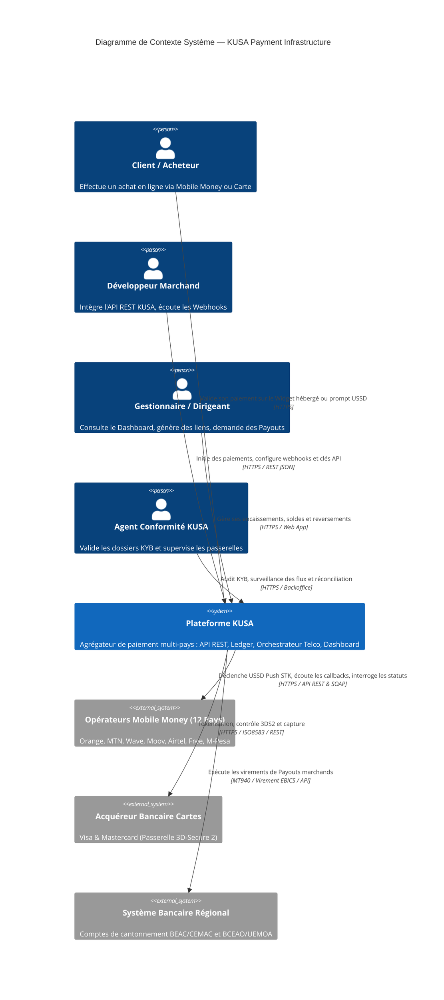
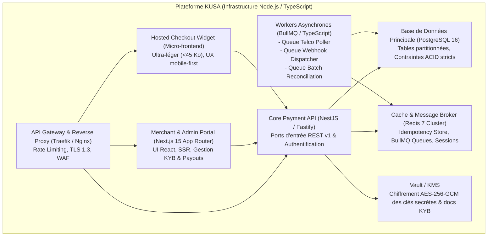
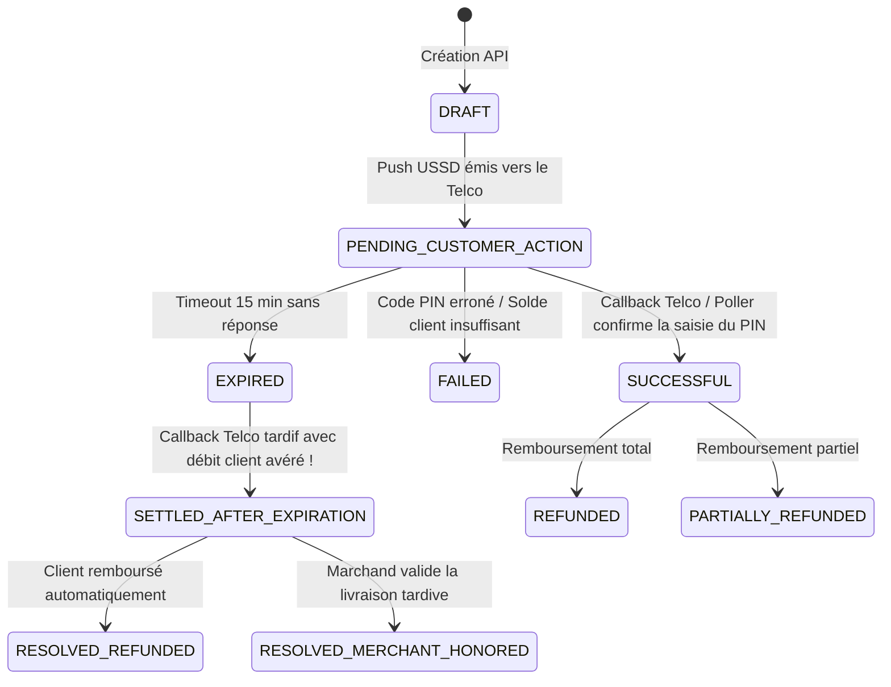

# KUSA — Architecture Technique & Clean Architecture Book
**Auteur** : Master Software Architect & Principal Fintech Engineer  
**Version** : 1.0.0 — Production Specification  
**Date** : Septembre 2026  
**Infrastructure Cible** : [kusa.cm](https://kusa.cm/) — Agrégateur Panafricain de Paiement (12 Pays)

---

## Sommaire
1. [Vue d'Ensemble & Diagrammes C4](#1-vue-densemble--diagrammes-c4)
2. [Conception Clean Architecture & Découpage Hexagonal](#2-conception-clean-architecture--découpage-hexagonal)
3. [Le Moteur Comptable : Grand Livre à Double Entrée (Immutable Ledger)](#3-le-moteur-comptable--grand-livre-à-double-entrée)
4. [Machine à États & Traitement des Cas Limites (Skeptic Resolution)](#4-machine-à-états--traitement-des-cas-limites)
5. [Matrice d'Intégration & de Routage des 12 Pays Africains](#5-matrice-dintégration--de-routage-des-12-pays-africains)
6. [Sécurité Cryptographique, Idempotence & Webhooks](#6-sécurité-cryptographique-idempotence--webhooks)
7. [Moteur de Réconciliation à Froid (Batch End-of-Day)](#7-moteur-de-réconciliation-à-froid-batch-end-of-day)
8. [Schéma de Données Détaillé (PostgreSQL DDL & Modélisation)](#8-schéma-de-données-détaillé-postgresql-ddl)

---

## 1. Vue d'Ensemble & Diagrammes C4

### 1.1 Diagramme C4 Niveau 1 : Contexte Système



### 1.2 Diagramme C4 Niveau 2 : Conteneurs & Découplage



---

## 2. Conception Clean Architecture & Découpage Hexagonal

Le code suit strictement les principes de la **Clean Architecture** d'Uncle Bob et de l'architecture hexagonale (Ports & Adapters) :

```
apps/api/src/
├── domain/                      # CŒUR MÉTIER PUR (Aucune dépendance externe)
│   ├── entities/
│   │   ├── Merchant.ts          # Profil marchand, statut KYB, clés API
│   │   ├── KybDocument.ts       # Document légal (RCCM, NIU, CNI)
│   │   ├── PaymentIntent.ts     # Intention de paiement & machine à états
│   │   ├── Transaction.ts       # Transaction technique liée à une tentative
│   │   ├── PayoutRequest.ts     # Demande de reversement de fonds
│   │   └── WebhookDelivery.ts   # Tentative de livraison webhook
│   ├── value-objects/
│   │   ├── Money.ts             # Montant entier (cents/centimes) + Currency ISO
│   │   ├── PhoneNumber.ts       # E.164 standardisé (+237, +225, etc.)
│   │   ├── IdempotencyKey.ts    # UUID v4 ou chaîne sécurisée (max 128 chars)
│   │   ├── ApiKey.ts            # Préfixes pk_live_, sk_live_, pk_test_, sk_test_
│   │   └── HmacSignature.ts     # Empreinte SHA256 hexadécimale
│   ├── services/
│   │   ├── DoubleEntryLedger.ts # Règle mathématique Débit = Crédit
│   │   ├── FeeCalculator.ts     # Calcul des commissions KUSA et telcos
│   │   └── OperatorRouter.ts    # Algorithme de sélection de passerelle
│   └── events/
│       ├── PaymentSucceeded.ts
│       ├── PaymentSettledLate.ts
│       └── PayoutInitiated.ts
│
├── application/                 # CAS D'USAGE MÉTIER (Orchestration)
│   ├── ports/
│   │   ├── in/                  # Interfaces des Use Cases (Primary Ports)
│   │   │   ├── InitiatePaymentUseCase.ts
│   │   │   ├── HandleTelcoCallbackUseCase.ts
│   │   │   ├── PollPaymentStatusUseCase.ts
│   │   │   ├── ExecutePayoutUseCase.ts
│   │   │   └── SubmitKybUseCase.ts
│   │   └── out/                 # Interfaces d'Infrastructure (Secondary Ports)
│   │       ├── PaymentRepositoryPort.ts
│   │       ├── LedgerRepositoryPort.ts
│   │       ├── TelcoGatewayPort.ts
│   │       ├── SecretVaultPort.ts
│   │       └── WebhookQueuePort.ts
│   └── use-cases/
│       ├── InitiatePaymentService.ts
│       ├── HandleTelcoCallbackService.ts
│       └── ExecutePayoutService.ts
│
└── infrastructure/              # ADAPTATEURS TECHNIQUES (Frameworks & Drivers)
    ├── adapters/
    │   ├── telcos/
    │   │   ├── OrangeMoneyAdapter.ts
    │   │   ├── MtnMomoAdapter.ts
    │   │   ├── WaveAdapter.ts
    │   │   └── MoovAdapter.ts
    │   ├── cards/
    │   │   └── Cybersource3DS2Adapter.ts
    │   ├── persistence/
    │   │   ├── PostgresPaymentRepository.ts
    │   │   └── PostgresLedgerRepository.ts
    │   └── queues/
    │       ├── BullMqWebhookQueue.ts
    │       └── BullMqPollerQueue.ts
    └── controllers/             # REST API Controllers (NestJS)
        ├── PaymentController.ts
        ├── PayoutController.ts
        └── WebhookIngestController.ts
```

---

## 3. Le Moteur Comptable : Grand Livre à Double Entrée (Immutable Ledger)

Pour prévenir tout risque de double dépense, de solde négatif ou de litige avec les autorités bancaires (COBAC / BCEAO), KUSA implémente un **Grand Livre à Double Entrée immuable** (`Double-Entry Ledger`).

### 3.1 Plan Comptable KUSA (Chart of Accounts)
Chaque marchand et chaque entité KUSA possède des comptes virtuels libellés dans la devise de la transaction :

| Code Compte | Propriétaire | Description |
|---|---|---|
| `AC_MERCHANT_AVAILABLE:{merchant_id}:{currency}` | Marchand | Fonds immédiatement décaissables par Payout |
| `AC_MERCHANT_PENDING:{merchant_id}:{currency}` | Marchand | Fonds encaissés en attente de clearing (J+1) |
| `AC_MERCHANT_RESERVE:{merchant_id}:{currency}` | Marchand | Réserve de garantie (5% retenus pour litiges) |
| `AC_KUSA_FEE_REVENUE:{currency}` | KUSA | Chiffre d'affaires commissions KUSA |
| `AC_TELCO_RECEIVABLE:{operator_id}:{country}:{currency}` | KUSA / Telco | Créance monétique sur l'opérateur (fonds collectés chez Orange/MTN) |
| `AC_BANK_SETTLEMENT:{bank_id}:{currency}` | KUSA / Banque | Liquidités réelles disponibles sur le compte bancaire de cantonnement KUSA |

### 3.2 Exemple d'Écriture : Encaissement de 10 000 XAF (Commission KUSA 3%)

```
Transaction TX_7891 (Encaissement Orange Money Cameroun)
--------------------------------------------------------------------------------------
1. Débit  : AC_TELCO_RECEIVABLE:ORANGE:CM:XAF         +10 000 XAF  (L'opérateur nous doit 10 000)
2. Crédit : AC_KUSA_FEE_REVENUE:XAF                     +300 XAF  (Commission KUSA de 3%)
3. Crédit : AC_MERCHANT_RESERVE:M102:XAF                +500 XAF  (5% réserve de garantie)
4. Crédit : AC_MERCHANT_PENDING:M102:XAF              +9 200 XAF  (Solde net marchand J+1)
--------------------------------------------------------------------------------------
TOTAL DÉBITS = 10 000 XAF  |  TOTAL CRÉDITS = 10 000 XAF  (Équilibre parfait : DELTA = 0)
```

### 3.3 Sécurisation contre les Race Conditions & Deadlocks
1. **Verrouillage Pessimiste Strict dans l'Ordre Lexicographique** :  
   Pour éliminer tout risque de Deadlock signalé par le Skeptic Agent lors de transactions simultanées, toutes les lignes de comptes verrouillées dans PostgreSQL via `SELECT ... FOR UPDATE` sont **impérativement triées par leur identifiant de compte unique par ordre alphabétique croissant**.
2. **Contrainte CHECK de Base de Données** :  
   Une contrainte SQL `CHECK (balance >= 0)` interdit au niveau du moteur de stockage tout solde négatif sur les comptes marchands disponibles.

---

## 4. Machine à États & Traitement des Cas Limites (Skeptic Resolution)

### 4.1 Diagramme d'États du `PaymentIntent`



### 4.2 Résolution du Problème des Paiements Tardifs (« Ghost Payments »)
Si l'opérateur valide le paiement après que KUSA a marqué l'intention `EXPIRED` :
1. Le callback entrant est intercepté par le Use Case `HandleTelcoCallbackService`.
2. Le système **refuse d'écraser aveuglément** vers `SUCCESSFUL`.
3. L'état bascule vers **`SETTLED_AFTER_EXPIRATION`**.
4. Les fonds sont cantonnés sur un compte d'attente d'arbitrage `AC_SUSPENSE_UNRECONCILED`.
5. Un webhook dédié `payment.settled_late` est immédiatement expédié au marchand avec deux options claires :
   - *Option Auto-Accept* : Si le marchand accepte la livraison tardive via l'API, les fonds sont crédités à son compte.
   - *Option Auto-Refund* : Sinon, KUSA déclenche un reversement de remboursement immédiat vers le numéro Mobile Money de l'acheteur. **Aucune spoliation d'argent, zéro réclamation non traitée**.

---

## 5. Matrice d'Intégration & de Routage des 12 Pays Africains

| # | Pays | Devise | Opérateurs Principaux | Protocole d'Intégration | Spécificités Techniques & Latences |
|---|---|---|---|---|---|
| 1 | 🇨🇲 **Cameroun** | XAF | Orange Money, MTN MoMo | REST API / USSD Push STK | Saisie PIN 10-60s. Polling à T+45s / T+90s. |
| 2 | 🇬🇦 **Gabon** | XAF | Airtel Money, Moov Africa | REST API / USSD Push | Vérification stricte des préfixes +241. |
| 3 | 🇨🇬 **Congo** | XAF | MTN MoMo, Airtel Money | REST API / USSD Push | Callback asynchrone prioritaire. |
| 4 | 🇹🇩 **Tchad** | XAF | Airtel Money, Moov Africa | USSD / SMS OTP | Tolérance timeout étendue à 180s. |
| 5 | 🇨🇫 **RCA** | XAF | Orange Money, Telecel | USSD Webkit | Réseau 2G dominant, idempotence vitale. |
| 6 | 🇬🇶 **Guinée Éq.** | XAF | Muni Dinero, Cartes | REST API / Switch bancaire | Routage bilingue (Espagnol / Français). |
| 7 | 🇨🇮 **Côte d’Ivoire**| XOF | Wave, Orange, MTN, Moov | REST / Deep Link Wave | Wave : confirmation en 1 clic (<3s). Orange/MTN : USSD. |
| 8 | 🇸🇳 **Sénégal** | XOF | Wave, Orange Money, Free | REST / QR Code / USSD | Wave prédominant, redirection URL fluide. |
| 9 | 🇧🇯 **Bénin** | XOF | MTN MoMo, Moov, Celtiis | REST API / Push STK | Support du nouvel entrant Celtiis Cash. |
| 10| 🇹🇬 **Togo** | XOF | T-Money, Moov Africa | REST API / USSD Push | Interconnexion switch national. |
| 11| 🇧🇫 **Burkina Faso**| XOF | Orange Money, Moov Africa | USSD Push / OTP | Validation OTP SMS fréquente. |
| 12| 🇨🇩 **RDC** | CDF/USD | M-Pesa, Orange, Airtel | REST API / Multi-devises | Gestion duale CDF et USD natif. |
| - | 💳 **Panafricain**| Toutes | Visa & Mastercard | 3D-Secure 2 Hosted Fields | Tokenisation sécurisée, PCI-DSS SAQ-A. |

---

## 6. Sécurité Cryptographique, Idempotence & Webhooks

### 6.1 Protocole d'Idempotence (`Idempotency-Key`)
- Tout appel `POST /v1/payments` et `POST /v1/payouts` exige l'en-tête HTTP `Idempotency-Key: <UUID>`.
- Stockage Redis avec TTL de 24 heures :
  - Si la clé est en cours de traitement : code HTTP `409 Conflict` ou mise en attente.
  - Si la clé a déjà été traitée : KUSA renvoie immédiatement la réponse mise en cache sans jamais solliciter à nouveau l'opérateur Telco.

### 6.2 Signatures Cryptographiques des Webhooks (HMAC-SHA256)
KUSA signe chaque webhook envoyé au serveur du marchand pour garantir son authenticité et son intégrité :
- En-tête : `X-Kusa-Signature: t=1727560000,v1=9b3a...`
- Formule : $\text{HMAC-SHA256}(t + "." + \text{payload}, \text{webhook\_secret})$
- Mécanisme anti-rejeu : tolérance maximale de 5 minutes sur le timestamp $t$.

### 6.3 Gestion des Retries de Webhooks avec Backoff Exponentiel
Les notifications d'événements sont gérées par la file BullMQ `webhook-dispatch-queue` :
1. Tentative 1 : Immédiate ($T$)
2. Tentative 2 : $T + 30$ secondes
3. Tentative 3 : $T + 5$ minutes
4. Tentative 4 : $T + 30$ minutes
5. Tentative 5 : $T + 2$ heures
Si les 5 tentatives échouent, le webhook passe en statut `DEAD_LETTER` et une alerte apparaît sur le dashboard du développeur avec possibilité de renvoi manuel en un clic.

---

## 7. Moteur de Réconciliation à Froid (Batch End-of-Day)

Pour répondre à l'angle mort soulevé lors de l'audit (les 1 à 3% de transactions telcos perdues ou sans callback) :
1. **Ingestion Quotidienne Automatique (01h00 GMT)** :  
   Un worker spécialisé se connecte aux serveurs SFTP sécurisés des opérateurs (Orange, MTN, Wave) ou ingère les fichiers MT940 des banques.
2. **Algorithme de Rapprochement (Matching 3 Voies)** :  
   - Voie 1 : Identifiant de transaction KUSA (`kusa_tx_id`).
   - Voie 2 : Identifiant de référence Telco (`telco_ref`).
   - Voie 3 : Triplet $\{ \text{Montant}, \text{Numéro de téléphone masqué}, \text{Horodatage } \pm 5 \text{ min} \}$.
3. **Traitement Automatisé des Écarts** :  
   - Transaction trouvée chez le Telco mais `PENDING` chez KUSA $\to$ Auto-settlement et régularisation du ledger.
   - Montant divergent $\to$ Alerte immédiate transmise au responsable conformité KUSA avec blocage préventif du payout associé.

---

## 8. Schéma de Données Détaillé (PostgreSQL DDL)

```sql
-- KUSA CORE DATABASE SCHEMA (PostgreSQL 16)

-- 1. Énumérations Métier
CREATE TYPE account_status_enum AS ENUM ('SANDBOX_ONLY', 'KYB_PENDING', 'LIVE_APPROVED', 'SUSPENDED');
CREATE TYPE payment_status_enum AS ENUM ('DRAFT', 'PENDING_CUSTOMER_ACTION', 'SUCCESSFUL', 'FAILED', 'EXPIRED', 'SETTLED_AFTER_EXPIRATION', 'REFUNDED');
CREATE TYPE channel_type_enum AS ENUM ('ORANGE_MONEY', 'MTN_MOMO', 'WAVE', 'MOOV_MONEY', 'AIRTEL_MONEY', 'FREE_MONEY', 'M_PESA', 'CARD_VISA_MC');
CREATE TYPE ledger_entry_direction_enum AS ENUM ('DEBIT', 'CREDIT');

-- 2. Table Marchands / Organisations
CREATE TABLE merchants (
    id UUID PRIMARY KEY DEFAULT gen_random_uuid(),
    legal_name VARCHAR(255) NOT NULL,
    trade_name VARCHAR(255),
    rccm_number VARCHAR(100),
    niu_number VARCHAR(100),
    country_code VARCHAR(2) NOT NULL, -- CM, CI, SN, etc.
    status account_status_enum NOT NULL DEFAULT 'SANDBOX_ONLY',
    created_at TIMESTAMPTZ NOT NULL DEFAULT NOW(),
    updated_at TIMESTAMPTZ NOT NULL DEFAULT NOW()
);

-- 3. Table Clés API & Sécurité
CREATE TABLE api_keys (
    id UUID PRIMARY KEY DEFAULT gen_random_uuid(),
    merchant_id UUID NOT NULL REFERENCES merchants(id) ON DELETE CASCADE,
    environment VARCHAR(10) NOT NULL CHECK (environment IN ('sandbox', 'live')),
    public_key VARCHAR(64) UNIQUE NOT NULL,      -- pk_live_... ou pk_test_...
    hashed_secret_key VARCHAR(255) NOT NULL,     -- Argon2id hash de sk_live_...
    encrypted_secret_key TEXT NOT NULL,          -- AES-256-GCM chiffré par KMS
    is_active BOOLEAN NOT NULL DEFAULT TRUE,
    created_at TIMESTAMPTZ NOT NULL DEFAULT NOW(),
    expires_at TIMESTAMPTZ
);

-- 4. Table des Intentions de Paiement (Partitionnée par mois pour haute volumétrie)
CREATE TABLE payment_intents (
    id UUID NOT NULL DEFAULT gen_random_uuid(),
    merchant_id UUID NOT NULL REFERENCES merchants(id),
    idempotency_key VARCHAR(128) NOT NULL,
    environment VARCHAR(10) NOT NULL,
    amount_cents BIGINT NOT NULL CHECK (amount_cents > 0),
    currency VARCHAR(3) NOT NULL, -- XAF, XOF, CDF, EUR
    fee_cents BIGINT NOT NULL DEFAULT 0,
    channel channel_type_enum NOT NULL,
    country_code VARCHAR(2) NOT NULL,
    customer_phone VARCHAR(32),
    customer_email VARCHAR(255),
    status payment_status_enum NOT NULL DEFAULT 'DRAFT',
    telco_reference VARCHAR(255),
    callback_url TEXT,
    created_at TIMESTAMPTZ NOT NULL DEFAULT NOW(),
    updated_at TIMESTAMPTZ NOT NULL DEFAULT NOW(),
    PRIMARY KEY (id, created_at)
) PARTITION BY RANGE (created_at);

-- Index critiques pour le routing et l'idempotence
CREATE UNIQUE INDEX idx_payment_intents_idempotency 
    ON payment_intents (merchant_id, idempotency_key, environment, created_at);
CREATE INDEX idx_payment_intents_status ON payment_intents (status, channel);

-- 5. Grand Livre Comptable (Ledger Accounts & Entries)
CREATE TABLE ledger_accounts (
    id UUID PRIMARY KEY DEFAULT gen_random_uuid(),
    account_code VARCHAR(128) UNIQUE NOT NULL, -- ex: AC_MERCHANT_AVAILABLE:UUID:XAF
    merchant_id UUID REFERENCES merchants(id),
    currency VARCHAR(3) NOT NULL,
    balance BIGINT NOT NULL DEFAULT 0 CHECK (balance >= 0),
    created_at TIMESTAMPTZ NOT NULL DEFAULT NOW(),
    updated_at TIMESTAMPTZ NOT NULL DEFAULT NOW()
);

CREATE TABLE ledger_entries (
    id UUID PRIMARY KEY DEFAULT gen_random_uuid(),
    transaction_id UUID NOT NULL,
    account_id UUID NOT NULL REFERENCES ledger_accounts(id),
    direction ledger_entry_direction_enum NOT NULL,
    amount_cents BIGINT NOT NULL CHECK (amount_cents > 0),
    description TEXT NOT NULL,
    created_at TIMESTAMPTZ NOT NULL DEFAULT NOW()
);

CREATE INDEX idx_ledger_entries_account ON ledger_entries (account_id, created_at DESC);
```
